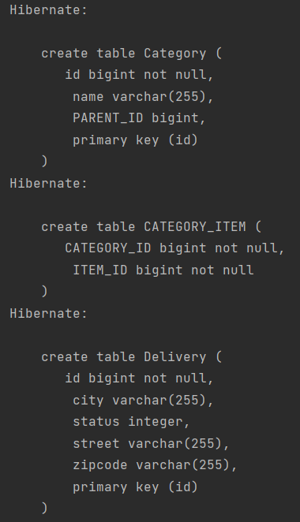
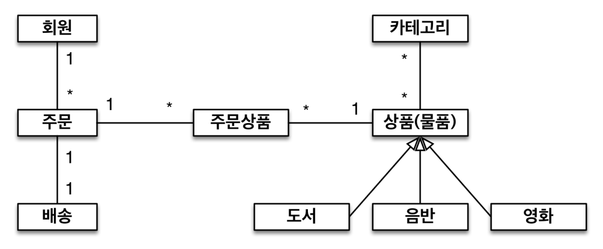

# 실전 예제 - 1. 요구사항 분석과 기본 매핑

**요구사항 분석**

---

- 회원은 상품을 주문할 수 있다.
- 주문 시 여러 종류의 상품을 선택할 수 있다.

**기능 목록**

---

- 회원 기능
    - 회원 등록
    - 회원 조회
- 상품 기능
    - 상품 등록
    - 상품 수정
    - 상품 조회
- 주문 기능
    - 상품 주문
    - 주문 내역 조회
    - 주문 취소


**도메인 분석 모델**

---

- **회원과 주문의 관계**: **회원**은 여러 번 **주문**할 수 있다. (일대다)
- **주문과 상품의 관계**: **주문**할 때 여러 **상품**을 선택할 수 있다. 반대로 같은 **상품**도 여러 번 **주문**될 수 있다. **주문상품**이라는 모델을 만들어서 다대다 관계를 일대다, 다대다 관계로 풀어냄


**테이블 설계**

---


**엔티티 설계와 매핑**

---


*Member*

```java
@Entity
public class Member {

    @Id @GeneratedValue
    @Column(name = "MEMBER_ID")
    private Long id;

    private String name;

    private String city;

    private String street;

    private String zipcode;

    //Setter, Getter ...
}
```

- 가급적 Setter는 최소한으로 줄여 아무데서나 데이터를 set 할 수 없게 해놓는게 유지보수면에 좋다.
- 테이블 필드의 속성이나 테이블의 제약조건 등 `Entity`에 정의를 해놓으면 개발자가 보기에 편하다.

*Order*

```java
@Entity
@Table(name = "ORDERS")
public class Order {

    @Id @GeneratedValue
    @Column(name = "ORDER_ID")
    private Long id;

    @Column(name = "MEMBER_ID")
    private Long memberId;

    private LocalDateTime orderDate;

    @Enumerated(EnumType.STRING)
    private OrderStatus status;

    //Setter, Getter ...
}

```

*OrderItem*

```java
@Entity
public class OrderItem {

    @Id @GeneratedValue
    @Column(name = "ORDER_ITEM_ID")
    private Long id;

    @Column(name = "ORDER_ID")
    private Long orderId;

    @Column(name = "ITEM_ID")
    private Long itemId;

    private int orderPrice;

    private int count;

    //Setter, Getter ...
}

```

*Item*

```java
@Entity
public class Item {

    @Id @GeneratedValue
    @Column(name = "ITEM_ID")
    private Long id;

    private String name;

    private int price;

    private int stockQuantity;

    //Setter, Getter ...
}

```

*JpaMain*

```java
public class JpaMain {

    public static void main(String[] args) {
        EntityManagerFactory emf = Persistence.createEntityManagerFactory("hello");

        EntityManager em = emf.createEntityManager();

        EntityTransaction tx = em.getTransaction();
        tx.begin();

        try {
            tx.commit();
        } catch (Exception e) {
            tx.rollback();
        } finally {
            em.close();
        }

        emf.close();
    }
}
```


# 실전 예제 - 2. 연관관계 매핑 시작

**테이블 설계**

---


- 실전 예제 1과 테이블 구조는 동일

**객체 구조**

---

- 참조를 사용하도록 변경


- **Member 엔티티에 orders(주문 목록)가 존재하는데 잘못된 설계 방식이라고 한다.**
  - 양방향 매핑 예시를 위해 어쩔 수없이 사용함
  - Member 엔티티는 회원에 관련된 멤버 변수만 가지고 있으면 된다.
- **설계할 때는 객체들 간에 매핑을 단방향으로 하고 실제 개발할 때 필요시 양방향으로 적용하는게 좋다.**
- 즉 양방향보단 단방향을 지향한다.

*Member*

```java
@Entity
public class Member {

    @Id @GeneratedValue
    @Column(name = "MEMBER_ID")
    private Long id;

    @OneToMany(mappedBy = "member")
    private List<Order> orders = new ArrayList<>();

    private String name;

    private String city;

    private String street;

    private String zipcode;

    //Getter, Setter...
}
```

- 관례상 멤버 변수가 컬렉션 클래스일때는 new(객체 생성)를 사용해서 초기화를 해준다. 메모리를 좀 쓸 수 있지만 NPE도 방지하고 여러가지 장점이 있다.

*Order*

```java
@Entity
@Table(name = "ORDERS")
public class Order {

    @Id @GeneratedValue
    @Column(name = "ORDER_ID")
    private Long id;

    @ManyToOne
    @JoinColumn(name = "MEMBER_ID")
    private Member member;

    @OneToMany(mappedBy = "order")
    private List<OrderItem> orderItems = new ArrayList<>();

    private LocalDateTime orderDate;

    @Enumerated(EnumType.STRING)
    private OrderStatus status;

    public void addOrderItem(OrderItem orderItem) {
        orderItems.add(orderItem);
        orderItem.setOrder(this);
    }

		//Getter, Setter...
}
```

*OrderItem*

```java
@Entity
public class OrderItem {

    @Id @GeneratedValue
    @Column(name = "ORDER_ITEM_ID")
    private Long id;

    @ManyToOne
    @JoinColumn(name = "ORDER_ID")
    private Order order;

    @ManyToOne
    @JoinColumn(name = "ITEM_ID")
    private Item item;

    private int orderPrice;

    private int count;

    //Getter, Setter...
}
```

*Item*

```java
@Entity
public class Item {

    @Id @GeneratedValue
    @Column(name = "ITEM_ID")
    private Long id;

    private String name;

    private int price;

    private int stockQuantity;

    //Getter, Setter...
}
```

# 실전 예제 - 3. 다양한 연관관계 매핑

**배송, 카테고리 추가 - 엔티티**

---

- 주문과 배송은 1:1(`@OneToOne`)
- 상품과 카테고리는 N:M(`@ManyToMany`)


- **실무에서 `@ManyToMany`는 사용하지 않는다고 했는데 예시이기 때문에 사용**

**배송, 카테고리 추가 - ERD**

---


**배송, 카테고리 추가 - 엔티티 상세**

---


*Member*

```java
@Entity
public class Member {

    @Id @GeneratedValue
    @Column(name = "MEMBER_ID")
    private Long id;

    @OneToMany(mappedBy = "member")
    private List<Order> orders = new ArrayList<>();

    private String name;

    private String city;

    private String street;

    private String zipcode;

    //Getter, Setter...
}
```

*Order*

```java
@Entity
@Table(name = "ORDERS")
public class Order {

    @Id @GeneratedValue
    @Column(name = "ORDER_ID")
    private Long id;

    @ManyToOne
    @JoinColumn(name = "MEMBER_ID")
    private Member member;

    @OneToOne
    @JoinColumn(name = "DELIVERY_ID")
    private Delivery delivery;

    @OneToMany(mappedBy = "order")
    private List<OrderItem> orderItems = new ArrayList<>();

    private LocalDateTime orderDate;

    @Enumerated(EnumType.STRING)
    private OrderStatus status;

    //Getter, Setter...
}
```

*Delivery*

```java
@Entity
public class Delivery {

    @Id @GeneratedValue
    private Long id;

    private String city;
    private String street;
    private String zipcode;
    private DeliveryStatus status;

    @OneToOne(mappedBy = "delivery")
    private Order order;

    //Getter, Setter...
}
```

- `Order` 테이블에 외래 키 `DELIVERY_ID`가 존재하므로 `Order`객체가 연관관계에서 주인이 된다.

*OrderItem*

```java
@Entity
public class OrderItem {

    @Id @GeneratedValue
    @Column(name = "ORDER_ITEM_ID")
    private Long id;

    @ManyToOne
    @JoinColumn(name = "ORDER_ID")
    private Order order;

    @ManyToOne
    @JoinColumn(name = "ITEM_ID")
    private Item item;

    private int orderPrice;

    private int count;

    //Getter, Setter...
}
```

*Item*

```java
@Entity
public class Item {

    @Id @GeneratedValue
    @Column(name = "ITEM_ID")
    private Long id;

    private String name;

    private int price;

    private int stockQuantity;

    @ManyToMany(mappedBy = "items")
    private List<Category> categories = new ArrayList<>();
		
    //Getter, Setter...
}
```

*Category*

```java
@Entity
public class Category {

    @Id @GeneratedValue
    private Long id;

    private String name;

    @ManyToOne
    @JoinColumn(name = "PARENT_ID")
    private Category parent;

    @OneToMany(mappedBy = "parent")
    private List<Category> child = new ArrayList<>();

    @ManyToMany
    @JoinTable(name = "CATEGORY_ITEM",
            joinColumns = @JoinColumn(name = "CATEGORY_ID"),
            inverseJoinColumns = @JoinColumn(name = "ITEM_ID"))
    private List<Item> items = new ArrayList<>();
    
    //Getter, Setter...
}
```

- `@ManyToMany`를 사용하며 `@JoinTable`을 사용해 `CATEGORY_ITEM` 이라는 테이블을 생성
  - `CATEGORY_ITEM`에서 조인하는 컬럼(`joinColumns`)은 `CATEGORY_ID`이고, 반대쪽에서 조인해야 하는 컬럼(`inverseJoinColumns`)은 `ITEM_ID`이다 라고 명시를 해준다.

*실행*




- 위의 테이블 구조대로 테이블이 생성된걸 확인할 수 있다.
- `CATEGORY_ITEM`이라는 중간 테이블이 생성되고 `CATEGORY_ITEM`, `ITEM_ID` 컬림이 생성된게 확인된다.

**N:M 관계는 1:N, N:1로**

---

- 테이블의 N:M 관계는 중간 테이블을 이용해서 1:N, N:1
- 실전에서는 중간 테이블이 단순하지 않다.
- `@ManyToMany`의 제약: 필드 추가X, 엔티티 테이블 불일치
- **실전에서는 `@ManyToMany` 사용X**

**@JoinColumn**

---

- 외래 키를 매핑할 때 사용

| 속성                                                          | 설명 | 기본값 |
|-------------------------------------------------------------| --- | --- |
| name                                                        | 매핑할 외래 키 이름 | 필드명 + _ + 참조하는 테이블의 기본 키 컬럼명 |
| referencedColumnName                                        | 외래 키가 참조하는 대상 테이블의 컬럼명 | 참조하는 테이블의 기본 키 컬럼명 |
| foreignKey(DDL)                                             | 외래 키 제약조건을 직접 지정할 수 있다.
 이 속성은 테이블을 생성할 때만 사용한다.                                     |  |
| unique<br/> nullable<br/> insertable<br/> updatable<br/> columnDefinition<br/> table | @Column의 속성과 같다. |  |

**@MnayToOne - 주요 속성**

---

- 다대일 관계 매핑

| 속성 | 설명 | 기본값                                                     |
| --- | --- |---------------------------------------------------------|
| optional | false로 설정하면 연관된 엔티티가 항상 있어야 한다. | TRUE                                                    |
| fetch | 글로벌 페치 전략을 설정한다.| @ManyToOne=FetchType.EAGER<br/>@OneToOne=FetchType.LAZY |
| cascade | 영속성 전이 기능을 사용한다. |                                                         |
| targetEntity | 연관된 엔티티의 타입 정보를 설정한다. 이 기능은 거의 사용하지 않는다. 컬렉션을 사용해도 제네릭으로 타입 정보를 알 수 있다. |                                                         |

**@OneToMany - 주요 속성**

---

- 다대일 관계 매핑

| 속성 | 설명 | 기본값 |
| --- | --- | --- |
| mappedBy | 연관관계의 주인 필드를 선택한다. |  |
| fetch | 글로벌 페치 전략을 설정한다. | @ManyToOne=FetchType.EAGER<br/>@OneToMany=FetchType.LAZY |
| cascade | 영속성 전이 기능을 사용한다. |  |
| targetEntity | 연관된 엔티티의 타입 정보를 설정한다. 이 기능은 거의 사용하지 않는다. 컬렉션을 사용해도 제네릭으로 타입 정보를 알 수 있다. |  |
- `@OneToMany`는 mappedBy 속성을 가지고 있지만, `@ManyToOne`은 가지고 있지않다.
  - 즉, `@ManyToOne`은 꼭 연관관계의 주인이 되어야 한다.
  - `insertable = false, updatable = false` 로 주인이 될 수는 있다. (권장 X)

# 실전 예제 - 4. 상속관계 매핑

**요구사항 추가**

---

- 상품의 종류는 음반, 도서, 영화가 있고 이후 더 확장될 수 있다.
- 모든 데이터는 등록일과 수정일이 필수다.

**도메인 모델**

---




*BaseEntity*

```java
@MappedSuperclass
public abstract class BaseEntity {

    private String createBy;
    private LocalDateTime createdDate;
    private String lastModifiedBy;
    private LocalDateTime lastModifiedDate;

    //Getter, Setter
}
```

- `BaseEntity`를 생성해 ‘모든 데이터는 등록일과 수정일이 필수다’ 해당 요건을 충족

*Member*

```java
@Entity
public class Member extends BaseEntity {

    @Id @GeneratedValue
    @Column(name = "MEMBER_ID")
    private Long id;

    //관례상 멤버 변수가 컬렉션 클래스일때는 new(객체 생성)를 사용해서 초기화를 해준다. 메모리를 좀 쓸 수 있지만 NPE도 방지하고 여러가지 장점이 있다.
    @OneToMany(mappedBy = "member")
    private List<Order> orders = new ArrayList<>();

    private String name;

    private String city;

    private String street;

    private String zipcode;

    //Getter, Setter...
}
```

*Order*

```java
@Entity
@Table(name = "ORDERS")
public class Order extends BaseEntity {

    @Id @GeneratedValue
    @Column(name = "ORDER_ID")
    private Long id;

    @ManyToOne
    @JoinColumn(name = "MEMBER_ID")
    private Member member;

    @OneToOne
    @JoinColumn(name = "DELIVERY_ID")
    private Delivery delivery;

    @OneToMany(mappedBy = "order")
    private List<OrderItem> orderItems = new ArrayList<>();

    private LocalDateTime orderDate;

    @Enumerated(EnumType.STRING)
    private OrderStatus status;

    public void addOrderItem(OrderItem orderItem) {
        orderItems.add(orderItem);
        orderItem.setOrder(this);
    }

    //Getter, Setter...
}
```

*Delivery*

```java
@Entity
public class Delivery extends BaseEntity {

    @Id @GeneratedValue
    @Column(name = "DELIVERY_ID")
    private Long id;

    private String city;
    private String street;
    private String zipcode;
    private DeliveryStatus status;

    @OneToOne(mappedBy = "delivery")
    private Order order;

    //Getter, Setter...
}
```

*OrderItem*

```java
@Entity
public class OrderItem extends BaseEntity {

    @Id @GeneratedValue
    @Column(name = "ORDER_ITEM_ID")
    private Long id;

    @ManyToOne
    @JoinColumn(name = "ORDER_ID")
    private Order order;

    @ManyToOne
    @JoinColumn(name = "ITEM_ID")
    private Item item;

    private int orderPrice;

    private int count;

    //Getter, Setter...
}
```

*Item*

```java
@Entity
@Inheritance(strategy = InheritanceType.SINGLE_TABLE)
@DiscriminatorColumn
public abstract class Item extends BaseEntity {

    @Id @GeneratedValue
    @Column(name = "ITEM_ID")
    private Long id;

    private String name;

    private int price;

    private int stockQuantity;

    @ManyToMany(mappedBy = "items")
    private List<Category> categories = new ArrayList<>();

    //Getter, Setter...
}
```

- `@Inheritance(strategy = InheritanceType.SINGLE_TABLE)`상속관계 부여(단일 테이블 전략)
- `@DiscriminatorColumn`생략 가능

*Album*

```java
@Entity
public class Album extends Item {

    private String artist;
    private String etc;

    //Getter, Setter...
}
```

*Book*

```java
@Entity
public class Book extends Item {

    private String author;
    private String isbn;

    //Getter, Setter...
}
```

*Movie*

```java
@Entity
public class Movie extends Item {

    private String director;
    private String actor;

    //Getter, Setter...
}
```

- `Album`, `Book`, `Movie`클래스 모두 Item 상속

*Category*

```java
@Entity
public class Category extends BaseEntity {

    @Id @GeneratedValue
    @Column(name = "CATEGORY_ID")
    private Long id;

    private String name;

    @ManyToOne
    @JoinColumn(name = "PARENT_ID")
    private Category parent;

    @OneToMany(mappedBy = "parent")
    private List<Category> child = new ArrayList<>();

    @ManyToMany
    @JoinTable(name = "CATEGORY_ITEM",
            joinColumns = @JoinColumn(name = "CATEGORY_ID"),
            inverseJoinColumns = @JoinColumn(name = "ITEM_ID"))
    private List<Item> items = new ArrayList<>();

    //Getter, Setter...
}
```

*JpaMain*

```java
Book book = new Book();
book.setName("JPA");
book.setAuthor("김영한");

em.persist(book);

tx.commit();
```

*실행 - 테이블 생성*

```sql
Hibernate: 
    
    create table Category (
       CATEGORY_ID bigint not null,
        createBy varchar(255),
        createdDate timestamp,
        lastModifiedBy varchar(255),
        lastModifiedDate timestamp,
        name varchar(255),
        PARENT_ID bigint,
        primary key (CATEGORY_ID)
    )
Hibernate: 
    
    create table CATEGORY_ITEM (
       CATEGORY_ID bigint not null,
        ITEM_ID bigint not null
    )
Hibernate: 
    
    create table Delivery (
       DELIVERY_ID bigint not null,
        createBy varchar(255),
        createdDate timestamp,
        lastModifiedBy varchar(255),
        lastModifiedDate timestamp,
        city varchar(255),
        status integer,
        street varchar(255),
        zipcode varchar(255),
        primary key (DELIVERY_ID)
    )
Hibernate: 
    
    create table Item (
       DTYPE varchar(31) not null,
        ITEM_ID bigint not null,
        createBy varchar(255),
        createdDate timestamp,
        lastModifiedBy varchar(255),
        lastModifiedDate timestamp,
        name varchar(255),
        price integer not null,
        stockQuantity integer not null,
        actor varchar(255),
        director varchar(255),
        author varchar(255),
        isbn varchar(255),
        artist varchar(255),
        etc varchar(255),
        primary key (ITEM_ID)
    )
Hibernate: 
    
    create table Member (
       MEMBER_ID bigint not null,
        createBy varchar(255),
        createdDate timestamp,
        lastModifiedBy varchar(255),
        lastModifiedDate timestamp,
        city varchar(255),
        name varchar(255),
        street varchar(255),
        zipcode varchar(255),
        primary key (MEMBER_ID)
    )
Hibernate: 
    
    create table OrderItem (
       ORDER_ITEM_ID bigint not null,
        createBy varchar(255),
        createdDate timestamp,
        lastModifiedBy varchar(255),
        lastModifiedDate timestamp,
        count integer not null,
        orderPrice integer not null,
        ITEM_ID bigint,
        ORDER_ID bigint,
        primary key (ORDER_ITEM_ID)
    )
Hibernate: 
    
    create table ORDERS (
       ORDER_ID bigint not null,
        createBy varchar(255),
        createdDate timestamp,
        lastModifiedBy varchar(255),
        lastModifiedDate timestamp,
        orderDate timestamp,
        status varchar(255),
        DELIVERY_ID bigint,
        MEMBER_ID bigint,
        primary key (ORDER_ID)
    )
```

- 테이블마다 등록일과 수정일이(등록자, 수정자) 존재하며,
  테이블 설계 그림과 같이 테이블이 생성될 걸 확인할 수 있다.

*실행 - 삽입*

```sql
Hibernate: 
    /* insert jpabook.jpashop.domain.Book
        */ insert 
        into
            Item
            (createBy, createdDate, lastModifiedBy, lastModifiedDate, name, price, stockQuantity, author, isbn, DTYPE, ITEM_ID) 
        values
            (?, ?, ?, ?, ?, ?, ?, ?, ?, 'Book', ?)
```